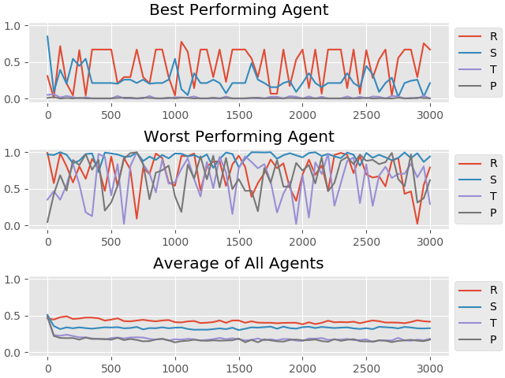
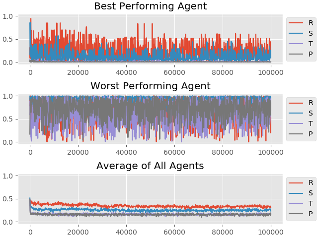
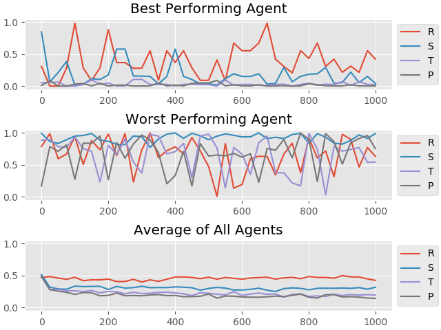
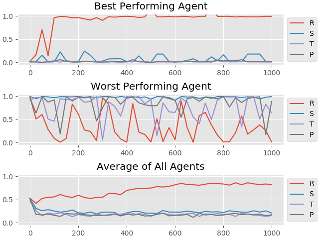
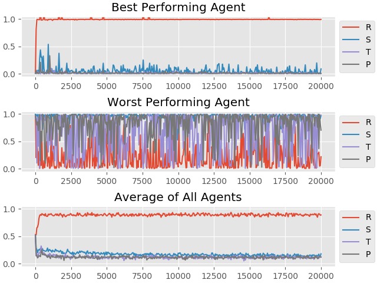
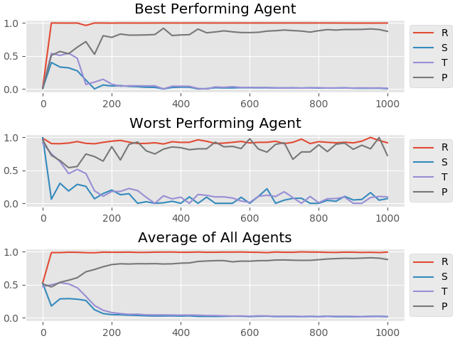
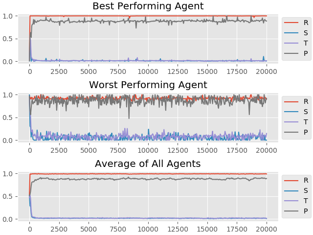

In this project I tried to recreate the results reached in an article named [A strategy of win-stay, lose-shift that outperforms tit-for-tat in the Prisoner's Dilemma game](https://www.nature.com/articles/364056a0)

In the article, simulation is explained with the followirng sentences:

> Two players are engaged in the Prisonner's Dilemma and have to choose between cooperation (C) and defection (D). According to their decisions, they are awarded with points. In any given round, the two players receive R points if both cooperate and only P points if they both defect; but a defector exploiting a cooperator gets T points, while the cooperator receives S (with T>R>P>S and 2R>T+S). Thus in a single round it is always best to defect, but cooperation may be rewarded in an iterated (or spatial) Prisoner's Dilemma.

There are two seperate folders, containing two seperate programs in this repository. One is the first implementation, written without use of multi-threading; in the second implementation, I tried to harness the power of multi-threading and somewhat succeeded.

## Results

As I developed the software, I gradually added new functionalities and tested them by generating data and observing the evolution of behavior of agents.

I started with the most basic functionalities; creating agents with random strategies, matching them to generate scores, replacing the worst performing agents with new random agents. Results looked like this:
  
##### Graph 1

In the plots, horizontal axis represents the number of generation. Vertical axis represents agent's probability to cooperate in the next round given the previous result. For example, it we can see that in the first generation, the best performing agent's probability of cooperating is a number just below 0.5 if the previous result is S (blue line).
  
##### Graph 2

##### Graph 3

Here are my observations for these 3 initial attemps:
- Average strategies are stable in uncooperative levels, no changes occur in the overall strategy of the population.
- Strategy of the best performing agent often attempts to develop a cooperative strategy but fails everytime.# Welcome to StackEdit!

### Adding Mutation

My next step was to add mutations. In every simulation, I set a probability of mutation in every generation. This is how it looked like in my first test with mutation added.

##### Graph 4

Since this is a short test with 1000 generations, there aren't major changes imidiately. It looks similar to the Graph 2 which was run without mutation.

### Changing Strategy Initialization to Sigmoid Function

When initializing strategy probabilities for a new agent, I was using pseudo-random values. I then decided to add a sigmoid function step to my strategy probability initialization. Combined with the addition of mutation, my next test produced the following result:

##### Graph 5

This was the first time cooperative strategy gained dominance. Best performing agent always had high S probability and average S probability gradually increased. After this short test with 1000 generations, I ran another test to see how strategies evolved for more generations:

##### Graph 6

### Adding Evolution Step 2

Until know, there were two ways for agents with new strategy probabilities to enter the generation: One is when worst performing agents get deleted and new agents with random strategies are created insted, and the other way is when an existing agents get mutated. In this step, I changed the former one so that strategy initialization is not random but is done by blending the strategies of the best performing agents.
This resulted in the following evolution:

###### Graph 7

In this test, generations evolved in a way that resulted in a described in the [paper](https://www.nature.com/articles/364056a0) as *Pavlov player*. This type of player is described with the following sentences in the paper:
> A Pavlov player cooperates if and only if both players opted for the same alternative in the previous move. The name stems from the fact that this strategy embodies the almost reflex-like response to the payoff: it repeats its former move if it was rewarded R or T points, but switches behaviour if it was punished by receiving only P or S points.

My second test with more generations created a similar result, with Pavlov domination.

###### Graph 8
